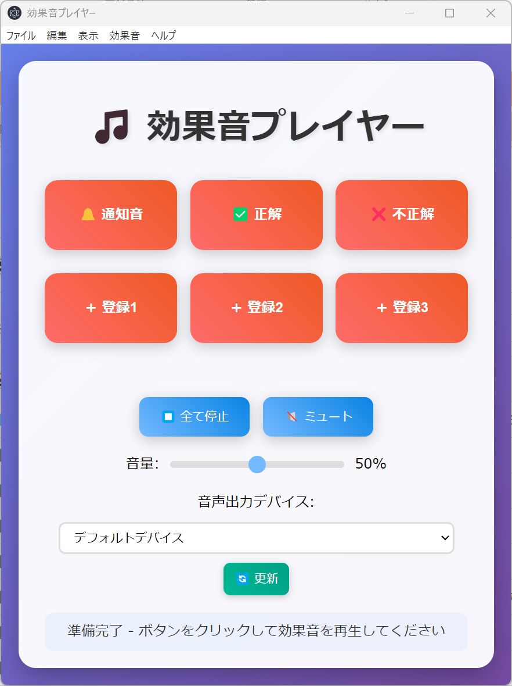

# SE Player (効果音プレイヤー)

ボタンを押すと対応する効果音を再生する、効果音プレイヤーアプリケーションです。

Electronアプリケーションまたは [ウェブサイト](https://kamicup.github.io/seplayer/) として動作します。



## 機能

- 3種類のプリセット効果音（通知音、正解音、不正解音）
- 3つのカスタムボタン（D&Dで音声ファイル登録＆ラベル編集可能）
- 音量調整機能（再生中も反映）
- 各ボタン下に再生進捗バー表示
- ボタンクリックで再生/停止
- 音声出力デバイスを選択可能
- Windows / MacOSX 用インストーラー作成対応

## プリセット音について

https://soundeffect-lab.info/ から以下の効果音を利用させていただきました。

- 決定ボタンを押す27.mp3
- クイズ正解2.mp3
- クイズ不正解2.mp3

## 効果音ボタン一覧

- **通知音**（プリセット）
- **正解**（プリセット）
- **不正解**（プリセット）
- **カスタム1**（D&Dで音声ファイル登録＆ラベル編集可）
- **カスタム2**（D&Dで音声ファイル登録＆ラベル編集可）
- **カスタム3**（D&Dで音声ファイル登録＆ラベル編集可）

## 使い方

1. アプリを起動し、効果音ボタンをクリックすると再生されます。
2. 再生中のボタンをもう一度クリックすると、その音が停止します。
3. カスタムボタンには音声ファイル（mp3, wav等）をドラッグ＆ドロップで登録できます。
   - 登録時、ボタンラベルはファイル名になります。ラベルは編集可能です。
4. 音量スライダーで再生中の音量もリアルタイムに調整できます。
5. 「全て停止」ボタンで全ての音を停止できます。
6. 「ミュート」ボタンで全ての音を一時的に消音できます。

## インストールと実行（開発者向け）

### 必要な環境
- Node.js (v14以上)
- npm
- Windows 10/11 または MacOSX

### セットアップ

1. 依存関係をインストール:
   ```bash
   npm install
   ```
2. アプリケーションを実行:
   ```bash
   npm start
   ```
3. インストーラーを作成:
   ```bash
   npm run build
   ```
   - `dist/SE Player Setup 1.0.0.exe` などが生成されます。

## ファイル構成

```
seplayer/
├── index.html          # メインHTMLファイル
├── script.js           # 効果音再生ロジック
├── main.js             # Electronメインプロセス
├── preload.js          # Electronプリロードスクリプト
├── package.json        # プロジェクト設定
├── README.md           # このファイル
└── dist/               # ビルド成果物
```

## ライセンス

MIT License
